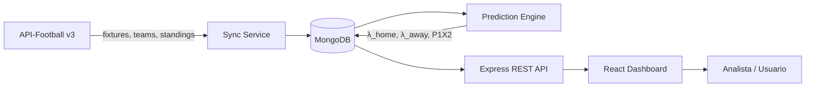

# Arquitectura — Predictive Modeling

## Visión general

Predictive Modeling es un dashboard MERN que ingiere datos de la Liga Argentina desde **API-Football v3**, los persiste en **MongoDB**, calcula predicciones con el modelo **Dixon-Coles** (Poisson) y expone resultados al frontend React para análisis de apuestas.

## Flujo de datos



### 1. Ingesta (API-Football v3)

| Endpoint externo | Uso interno |
|------------------|-------------|
| `GET /fixtures` | Partidos por liga/temporada/fecha |
| `GET /teams` | Catálogo de equipos argentinos |
| `GET /standings` | Posiciones y forma reciente |

El cliente `ApiFootballClient` (`backend/src/services/apiFootball.service.js`) encapsula autenticación (`x-apisports-key`) y normalización de respuestas.

### 2. Persistencia (MongoDB)

Patrón **Singleton** en `backend/src/config/db.js` para una única conexión Mongoose por proceso.

Modelos principales:

- **Team** — fuerzas ofensivas/defensivas (`attackStrength`, `defenseStrength`)
- **Match** — fixture, resultado real y predicción calculada

### 3. Motor de predicción y calibración

`predictionEngine.service.js` implementa Dixon-Coles.  
`strengthCalibration.service.js` estima A/D por equipo desde partidos finalizados.  
`syncService.js` orquesta: **sync API-Football → calibrate → predict upcoming**.

Endpoints:

| Método | Ruta | Ticket |
|--------|------|--------|
| POST | `/api/sync` | PRODE-3 |
| POST | `/api/sync/calibrate` | PRODE-6 |
| GET | `/api/matches` | PRODE-7, PRODE-8 |
| GET | `/api/reports/backtest` | PRODE-10 |
| GET | `/api/reports/export.csv` | PRODE-11 |

Ver [math_model.md](./math_model.md) para el detalle matemático.

### 4. API REST (Express MVC)

```
backend/src/
├── config/       # env, db (Singleton)
├── controllers/  # lógica HTTP
├── middleware/   # validación Zod, sanitización, errores
├── models/       # esquemas Mongoose
├── routes/       # enrutamiento
└── services/     # dominio (API-Football, predicción)
```

### 5. Frontend (React + Vite)

SPA optimizada que consume `/api/*`:

- Vista de jornada con probabilidades 1X2
- Detalle de partido con matriz de marcadores
- Filtros por fecha/equipo (H8)

## Seguridad (Sprint 0 — OWASP)

| Control | Implementación |
|---------|----------------|
| A01 Broken Access Control | Rate limiting, CORS restringido |
| A03 Injection | Validación Zod + sanitización HTML |
| A05 Security Misconfiguration | Helmet, `X-Powered-By` deshabilitado |
| A07 XSS | `sanitize-html` en body/query/params |

## Trazabilidad Jira

Cada módulo incluye comentarios `PRODE-N` y estimación **T-Shirt** (XS–XL).

| Historia | Ticket Jira | Estado Sprint 0 |
|----------|-------------|-----------------|
| H1 Setup MERN | [PRODE-1](https://feelibizaproperties.atlassian.net/browse/PRODE-1) | Implementado |
| H2 MongoDB Singleton | [PRODE-2](https://feelibizaproperties.atlassian.net/browse/PRODE-2) | Implementado |
| H3 API-Football v3 | [PRODE-3](https://feelibizaproperties.atlassian.net/browse/PRODE-3) | Cliente base |
| H4 Modelos Team/Match | [PRODE-5](https://feelibizaproperties.atlassian.net/browse/PRODE-5) | Esquemas |
| H5 Motor Dixon-Coles | [PRODE-4](https://feelibizaproperties.atlassian.net/browse/PRODE-4) | Implementado |
| H6 Coeficientes A/D | [PRODE-6](https://feelibizaproperties.atlassian.net/browse/PRODE-6) | Pendiente |
| H7 Dashboard React | [PRODE-7](https://feelibizaproperties.atlassian.net/browse/PRODE-7) | MVP |
| H8 Filtros | [PRODE-8](https://feelibizaproperties.atlassian.net/browse/PRODE-8) | Pendiente |
| H9 Seguridad OWASP | [PRODE-9](https://feelibizaproperties.atlassian.net/browse/PRODE-9) | Implementado |
| H10 Backtesting | [PRODE-10](https://feelibizaproperties.atlassian.net/browse/PRODE-10) | Pendiente |
| H11 Export CSV | [PRODE-11](https://feelibizaproperties.atlassian.net/browse/PRODE-11) | Pendiente |
| H12 TDD Jest | [PRODE-12](https://feelibizaproperties.atlassian.net/browse/PRODE-12) | Implementado |

Proyecto Jira: **PRODE** — Predictive Modeling  
URL: https://feelibizaproperties.atlassian.net/jira/software/projects/PRODE
